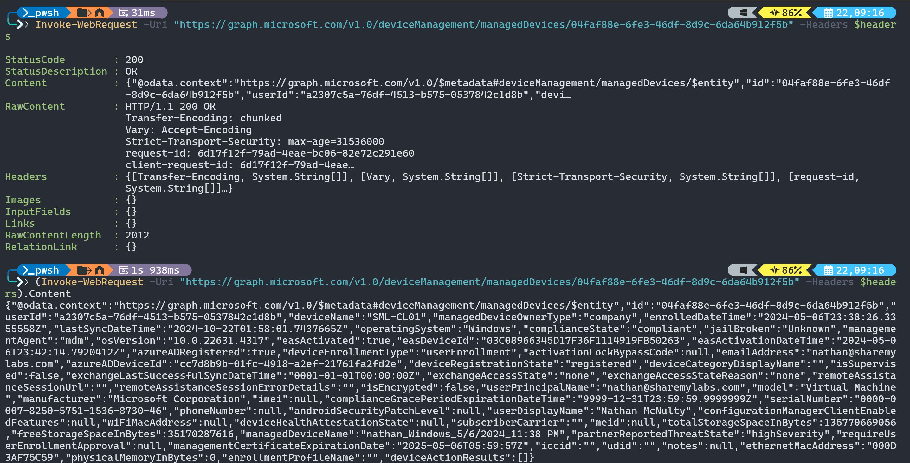
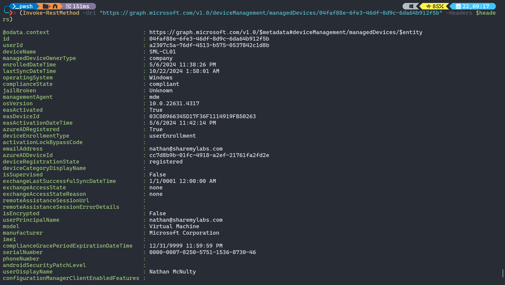
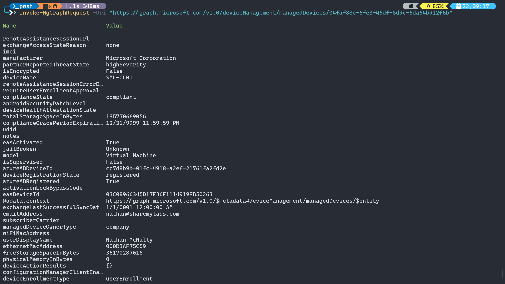

# Graph API

## Graph PowerShell

[Mapping from AzureAD and MSOnline modules](https://learn.microsoft.com/en-us/powershell/microsoftgraph/azuread-msoline-cmdlet-map?view=graph-powershell-1.0)  

[Migration steps from AzureAD modules to Graph PowerShell](https://learn.microsoft.com/en-us/powershell/microsoftgraph/migration-steps?view=graph-powershell-1.0)  

[Understanding Query Parameters](https://learn.microsoft.com/en-us/powershell/microsoftgraph/use-query-parameters?view=graph-powershell-1.0)  

### Find-MgGraphCommand

Graph PowerShell modules are auto-generated based on API endpoints, so the cmdlet names typically make less sense than other modules. To discover the module names and all the information about them, we can leverage Get-Command and Find-MgGraphCommand.

```powershell

Get-Command -Module Microsoft.Graph.DeviceManagement* -Name Get-*

Find-MgGraphCommand -Command Get-MgDeviceManagementDetectedApp | fl *

```

```output

Command          : Get-MgDeviceManagementDetectedApp
Module           : DeviceManagement
APIVersion       : v1.0
Method           : GET
URI              : /deviceManagement/detectedApps/{detectedApp-id}
OutputType       : IMicrosoftGraphDetectedApp
ApiReferenceLink : https://learn.microsoft.com/graph/api/intune-devices-detectedapp-get?view=graph-rest-1.0
Variants         : {Get, GetViaIdentity}
Permissions      : {DeviceManagementManagedDevices.Read.All, DeviceManagementManagedDevices.ReadWrite.All,
                   DeviceManagementConfiguration.ReadWrite.All, DeviceManagementConfiguration.Read.All}
CommandAlias     :

Command          : Get-MgDeviceManagementDetectedApp
Module           : DeviceManagement
APIVersion       : v1.0
Method           : GET
URI              : /deviceManagement/detectedApps
OutputType       : IMicrosoftGraphDetectedApp
ApiReferenceLink : https://learn.microsoft.com/graph/api/intune-devices-detectedapp-list?view=graph-rest-1.0
Variants         : {List}
Permissions      : {DeviceManagementManagedDevices.Read.All, DeviceManagementManagedDevices.ReadWrite.All,
                   DeviceManagementConfiguration.ReadWrite.All, DeviceManagementConfiguration.Read.All}
CommandAlias     :

```

### Direct API calls

We have a few ways to make calls against Graph API, and the most common ones will be Invoke-WebRequest, Invoke-RestMethod, and Invoke-MgGraphRequest.

**Invoke-WebRequest** is really designed for HTML type content, and while it can work with JSON and XML content, there are better options.

```powershell
$headers = @{ 
  Authorization = "Bearer $token"
  Content = "application/json"
}
Invoke-WebRequest -Uri "https://graph.microsoft.com/v1.0/deviceManagement/managedDevices/04faf88e-6fe3-46df-8d9c-6da64b912f5b" -Headers $headers

```



**Invoke-RestMethod** is designed for working with REST APIs and has much better handling of JSON, converts to objects better, and will be easier to work with if dealing with pagination



**Invoke-MgGraphRequest** builds on Invoke-RestMethod and abstracts tokens, pagination, and some other headers so we don’t need to pass them with our requests (or makes it much easier to, like –ConsistencyLevel eventual)



### Performance considerations

$select is –Property
$filter is -Filter
$count is –Top,

Use these to limit data and improve performance / reduce runtime costs, also compare-object and webhooks

[Guide to building advanced queries](https://devblogs.microsoft.com/microsoft365dev/build-advanced-queries-with-count-filter-search-and-orderby/) 

[Understanding consistencylevel](https://ourcloudnetwork.com/understanding-consistencylevel-eventual-with-microsoft-graph-powershell/)

**-Property**  
```powershell
Get-MgDevice  
(Get-MgDevice)[0] | fl *  
(Get-MgDevice -Property DisplayName,OperatingSystem)[0] | fl *  
```

**-Filter**  
```powershell
Get-MgDevice -Filter "DisplayName eq 'sml-cl01'"  
Get-MgDevice -Filter "startsWith(DisplayName,'sml')"  
Get-MgGroup -Filter "not(groupTypes/any(c:c eq 'Unified'))" # Throw error on purpose, show how to fix  
Get-MgGroup -Filter "not(groupTypes/any(c:c eq 'Unified'))" -ConsistencyLevel eventual -CountVariable $count  
```

**-Search**  
```powershell
Get-MgDevice -Search "displayName:cl01" -ConsistencyLevel eventual  
```

**-Top**  
```powershell
Get-MgUser -Top 10
```  

[Use delta endpoints!](https://learn.microsoft.com/en-us/graph/delta-query-overview)  

[Batching](https://learn.microsoft.com/en-us/graph/json-batching)  

### Entra device cleanup example

```powershell
Find-MgGraphCommand -Command *Device*
Find-MgGraphCommand -Command Remove-MgDevice | fl
# Let’s check the doc – delegated vs application permission  
# Grant permission for delegated vs app registration with API permission plus self signed certificate
Find-MgGraphCommand -Command *Bitlocker*
Get-MgInformationProtectionBitlocker
#Wait a minute!
Find-MgGraphCommand -Command Get-MgInformationProtectionBitlocker | fl
#Check the docs – permission, look at examples, realize you need a key, look at object
Get-MgInformationProtectionBitlockerRecoveryKey -Filter "deviceId eq 'da2f6920-d585-4e47-a9e5-71ae18e8456b’”
Get-MgInformationProtectionBitlockerRecoveryKey -BitlockerRecoveryKeyId e2586702-d618-430e-ba24-8249fe6d702c | fl *
Get-MgInformationProtectionBitlockerRecoveryKey -BitlockerRecoveryKeyId e2586702-d618-430e-ba24-8249fe6d702c -Property Key | fl *
Remove-MgDevice
```

## Graph API

### [Graph Explorer](https://developer.microsoft.com/en-us/graph/graph-explorer)

[Get user authentication methods  ](https://learn.microsoft.com/en-us/graph/api/authenticationmethod-get?view=graph-rest-1.0&tabs=http)  
```
GET https://graph.microsoft.com/v1.0/users/adrianemorrison@sharemylabs.com/authentication/methods
```

[Create TAP](https://learn.microsoft.com/en-us/graph/api/authentication-post-temporaryaccesspassmethods?view=graph-rest-1.0&tabs=http)  
```
POST https://graph.microsoft.com/v1.0/users/adrianemorrison@sharemylabs.com/authentication/temporaryAccessPassMethods  
Body: { "lifetimeInMinutes": 60, "isUsableOnce": false }
```

### Resources

[Merill's Permissions Explorer](https://graphpermissions.merill.net/permission/)  

[Batching](https://learn.microsoft.com/en-us/graph/json-batching)  

[Graph Webhooks](https://learn.microsoft.com/en-us/graph/change-notifications-delivery-webhooks?tabs=http)

[O365 Management Activity API Webhooks](https://github.com/nathanmcnulty/nathanmcnulty/blob/master/Azure/O365ManagementActivityAPI.ps1)  

[Connecting Power BI to Microsoft Graph](https://tech-peanuts.com/2020/05/28/connecting-power-bi-to-microsoft-graph/)  
