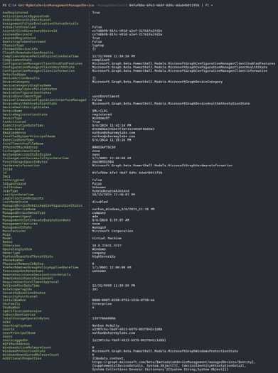

# Intune

## Graph API

Intune heavily leverages the Graph API as well, but when dealing with devices, we almost always want to query Intune Graph API endpoints instead of Entra.

**Get-MgDevice**  


**Get-MgDeviceManagementManagedDevice**  


### Examples

```powershell
Find-MgGraphCommand -uri "/deviceManagement/managedDevices"

# vs

Get-Command *sync* 

# Finally!

Sync-MgDeviceManagementManagedDevice -ManagedDeviceId $managedDeviceId
```

### Audit Logs

```powershell
(Get-MgBetaDeviceManagementAuditEvent -Property ActivityType).ActivityType | Select-Object -Unique

Get-MgBetaDeviceManagementAuditEvent -Filter "ActivityOperationType eq 'Delete'" -Top 200 | Sort-Object ActivityDateTime 
```

## Data Warehouse
Entities: Application, Date, Devices, Intune Management Extension, Policy, Mobile App Management (MAM), User, User Device Associations

### Resources

[Compliance Dashboard](https://appsource.microsoft.com/en-us/product/power-bi/pbi_intune.intune_compliance_dw_app?tab=Overview)  

[Microsoft Intune Examples](https://github.com/microsoft/Intune-Data-Warehouse)  

[Microsoft Tech Community Power BI How To](https://techcommunity.microsoft.com/t5/intune-customer-success/support-tip-using-powerbi-to-build-custom-reports-with-intune/ba-p/294970)  

## Remediations

### Resources

[Remediation Overview](https://learn.microsoft.com/en-us/mem/intune/fundamentals/powershell-scripts-remediation)  

[Joey Verlinden Blog](https://www.joeyverlinden.com/my-most-used-proactive-remediations/)  

[Community Remediation Library](https://github.com/JayRHa/EndpointAnalyticsRemediationScripts)

### Examples

```powershell
Get-MgBetaDeviceManagementDeviceHealthScript –All
Get-MgBetaDeviceManagementDeviceHealthScript -DeviceHealthScriptId "cb4d5849-4f5f-4c9a-afbb-cdbdbc149563"
Get-MgBetaDeviceManagementDeviceHealthScriptRunSummary -DeviceHealthScriptId "cb4d5849-4f5f-4c9a-afbb-cdbdbc149563"
Get-MgBetaDeviceManagementDeviceHealthScriptDeviceRunState -DeviceHealthScriptId "cb4d5849-4f5f-4c9a-afbb-cdbdbc149563"
```

### Automation

Automation below would not have happened without this blog:
[Damien Van Robaeys](https://www.systanddeploy.com/2020/12/manage-intune-proactive-remediation.html)  

Automate creating remediation scripts from the community library:

```powershell
Invoke-WebREquest -Uri "https://github.com/JayRHa/EndpointAnalyticsRemediationScripts/archive/refs/heads/main.zip" -OutFile .\remediations.zip
Expand-Archive ".\remediations.zip“
$path = ".\remediations\EndpointAnalyticsRemediationScripts-main\Get-BitlockerRecoveryKey“
$detection= [convert]::ToBase64String((Get-Content $path\detection_BitlockerRecoveryKey.ps1 -AsByteStream))
$remediation = [convert]::ToBase64String((Get-Content $path\remediation_BitlockerRecoveryKey.ps1 -AsByteStream))

Connect-MgGraph –Scopes DeviceManagementConfiguration.ReadWrite.All

$body = @{
  "@odata.type“ = "#microsoft.graph.deviceHealthScript"
  publisher = "JayRHa"
  version = “1"
  displayName = "Remediation package test"
  description = ""
  detectionScriptContent = "$detection"
  remediationScriptContent = "$remediation"
  runAsAccount = "system"
  runAs32Bit = "False"
}
Invoke-MgGraphRequest -Method POST -Uri "https://graph.microsoft.com/beta/deviceManagement/deviceHealthScripts" -Body $body
```

Automate retrieving remediation results:

```powershell
$deviceHealthScript = (Get-MgBetaDeviceManagementDeviceHealthScript -Filter "DisplayName eq 'Get-LocalAdmins'").Id
$body = @{
        "reportName" = "DeviceRunStatesByProactiveRemediation"
        "filter" = "PolicyId eq '$deviceHealthScript'"
        "format" = "csv"
}
$exportJobId = (Invoke-MgGraphRequest -Uri 'https://graph.microsoft.com/beta/deviceManagement/reports/exportJobs' -Method POST -Body $body).Id
$exportUrl = (Get-MgBetaDeviceManagementReportExportJob -DeviceManagementExportJobId $exportJobId).Url
Invoke-WebRequest -Uri $exportUrl -OutFile ".\$deviceHealthScript.csv.zip"
Expand-Archive ".\$deviceHealthScript.csv.zip"
notepad "$(Get-ChildItem -Path ".\$deviceHealthScript.csv")"

```

## Device Query

### Resources

[Device Query Docs](https://learn.microsoft.com/en-us/mem/analytics/data-platform-schema)

[Peter van der Woude](https://petervanderwoude.nl/post/getting-started-with-device-query/)

### Examples

```kql
BiosInfo

Certificate

FileInfo('C:\\Users\\AdrianeMorrison\\Downloads\\')
| where FileName endswith '.exe’

LocalUserAccount

Process
```

### Automation

This is how we can run a query via API against multiple devices (get group membership, get intune device id, save query in base64, run query)

```powershell
# You will need to obtain a bearer token with permissions to use device query and use it with this script
$token = Get-Clipboard

# Convert query to base64
$query = [Convert]::ToBase64String([char[]]'WindowsEvent("Microsoft-Windows-CodeIntegrity/Operational") | where EventId == 3076')

# Get devices from a group and translate to their Intune object ID
$devices = ((Get-MgGroupMember -GroupId 84e4d080-9f80-45b2-8c19-d2c2ab973745).Id | ForEach-Object {
    Get-MgDeviceManagementManagedDevice -Filter "AzureAdDeviceId eq '$((Get-MgDevice -DeviceId $_).DeviceId)'"
}).Id

# Make the request to create the device query for each device and store the Intune ID and query ID in a variable
$headers = @{
    "authorization"="Bearer $token"
}
$body = @{
    query = $query
} | ConvertTo-Json
$devices | ForEach-Object { 
    [array]$responses += "$_,$((Invoke-RestMethod -UseBasicParsing -Uri 'https://graph.microsoft.com/beta/deviceManagement/managedDevices/04faf88e-6fe3-46df-8d9c-6da64b912f5b/createQuery' -Method 'POST' -Headers $headers -ContentType 'application/json' -Body $body).Id)"
}

# The query may take a while and you'll need to play with the delay
Start-Sleep -Seconds 60

# Iterate through each response and get the results
$responses | ForEach-Object {
    [array]$results += (Invoke-RestMethod -Uri "https://graph.microsoft.com/beta/deviceManagement/managedDevices/$($_.split(',')[0])/queryResults/$($_.split(',')[1])" -Headers $headers -ContentType 'application/json').results
}

# Decode the base64 responses back to something we can read :)
$bytes = [Convert]::FromBase64String($results)
[System.Text.Encoding]::UTF8.GetString($bytes) | ConvertFrom-Json
```
